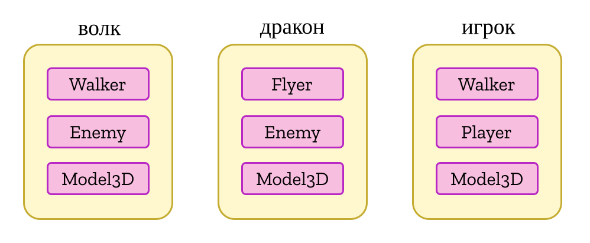

<language-switcher/>

# Сущности
Сущность &mdash; это объект с уникальным ID, очень похожий на объект JavaScript. Её предназначение заключается в том, чтобы сгруппировать компоненты; она может содержать не больше одного компонента каждого типа.



## Создание сущностей

Создать сущность можно вызвав метод `createEntity` в экземпляре [мира](./world#creating-entities) или [системы](./systems#creating-entities). Метод принимает начальные компоненты для сущности и опциональные объекты, содержащие стартовые значения полей компонентов.

```js
world.createEntity(ComponentFoo, {foo: 'bar', baz: 42}, ComponentBar);
```
```ts
world.createEntity(ComponentFoo, {foo: 'bar', baz: 42}, ComponentBar);
```

Сущность можно создать без компонентов, чтобы добавить их позже.

## Добавление компонентов

После того как сущность была создана, к ней можно в любое время добавить [компоненты](./components):

```ts
@component class ComponentA {
  @field.int32 declare value: number;
}
@component class ComponentB {
  @field.dynamicString(20) declare message: string;
}

// в системе, добавляем один компонент:
entity.add(ComponentA, {value: 10});
// или сразу несколько:
entity.addAll(ComponentA, {value: 10}, ComponentB, {message: 'hello'});
```
```js
class ComponentA {
  static schema = {
    value: Type.int32
  };
}
class ComponentB {
  static schema = {
    message: Type.dynamicString(20)
  };
}

// в системе, добавляем один компонент:
entity.add(ComponentA, {value: 10});
// или сразу несколько:
entity.addAll(ComponentA, {value: 10}, ComponentB, {message: 'hello'});
```

Методы `add` и `addAll` принимают такие же аргументы как `createEntity`, упомянутый выше.

Попытка добавления одного и того же компонента к сущности несколько раз приведёт к ошибке. Добавление компонента [из перечисления](components#component-enums) приведёт к автоматическому [удалению](#removing-components) всех остальных компонентов этого перечисления.

## Получение и изменение компонентов

Доступ к компоненту сущности можно получить двумя способами:
- `read(Component)`: вернёт компонент только для чтения. (Попытка записи значений в поля компонента приведёт к ошибке, если только вы не используете сборку с [повышенной производительностью](../deploying).)
- `write(Component)`: вернёт компонент для чтения и записи.

```ts
@component class ComponentA {
  @field.int32 declare value: number;
}
@component class ComponentB {
  @field.int32 declare value: number;
}

// читаем данные из одного компонеента и записываем их в другой в коде системы:
entity.write(ComponentA).value += entity.read(ComponentB).value;
```
```js
class ComponentA {
  static schema = {
    value: Type.int32
  };
}
class ComponentB {
  static schema = {
    value: Type.int32
  };
}

// читаем данные из одного компонеента и записываем их в другой в коде системы:
entity.write(ComponentA).value += entity.read(ComponentB).value;
```

::: danger
Не стоит полагаться на компонент, полученные при помощи `read` и `write`, т.к. он будет затёрт при следующем вызове `read` или `write` для этого же типа компонента.
:::

Такое разделение прав доступа призвано облегчить реализацию [реактивных запросов](./queries#reactive-queries) с минимальными накладками, позволяя системам получить список сущностей, компоненты которых были модифицированы. Однако стоит помнить, что компонент будет помечен как модифицированный при вызове `write` даже если на самом деле его свойства не изменились, так что имеет смысл стараться использовать `write` только тогда, когда компонент точно будет изменён.

Кроме того, разделение на `read` и `write` помогает понимать как системы обрабатывают компоненты, и позволяет Becsy автоматически определить порядок их выполнения и даже выполнять их параллельно без использования дорогих и опасных блокировок.

## Удаление компонентов

Другая частая операция над сущностями &mdash; удаление компонента:

```ts
entity.remove(ComponentA);
entity.removeAll(ComponentA, ComponentB);
```
```js
entity.remove(ComponentA);
entity.removeAll(ComponentA, ComponentB);
```

Удаление [перечисления](components#component-enums) из сущности на самом деле удаляет текущий компонент перечисления. Попытка удаления компонента, которого у сущности нет, приведёт к ошибке.

Удаление компонента из сущности происходит моментально, но на самом деле Becsy хранит его до конца следующего кадра. Это необходимо чтобы системы, которые реагируют на удаление, могли получить доступ к данным удалённого компонента. Получить недавно удалённый компонент можно таким образом:

```ts{6}
world.build(sys => {
  const entity = sys.createEntity(ComponentA, {value: 10});
  entity.read(ComponentA).value;  // 10
  entity.remove(ComponentA);
  // entity.read(ComponentA).value;  // ошибка!
  sys.accessRecentlyDeletedData();
  entity.read(ComponentA).value;  // 10
})
```
```js{6}
world.build(sys => {
  const entity = sys.createEntity(ComponentA, {value: 10});
  entity.read(ComponentA).value;  // 10
  entity.remove(ComponentA);
  // entity.read(ComponentA).value;  // ошибка!
  sys.accessRecentlyDeletedData();
  entity.read(ComponentA).value;  // 10
})
```

Однако нельзя записывать данные в удалённые компоненты.

## Проверка наличия компонентов

Чаще всего вы будете использовать [запросы](./queries), чтобы получить сущности с искомыми компонентами, но иногда может потребоваться проверить наличие компонента на ходу. Это особенно полезно при описании [валидации](./components#validation), но также может использоваться для проверки необходимости добавления или удаления компонента.

Некоторые методы, позволяющие делать такие проверки:
```ts
entity.has(ComponentA);
entity.hasSomeOf(ComponentA, ComponentB);
entity.hasAllOf(ComponentA, ComponentB);
entity.hasAnyOtherThan(ComponentA, ComponentB);
entity.countHas(ComponentA, ComponentB, ComponentC);
```
```js
entity.has(ComponentA);
entity.hasSomeOf(ComponentA, ComponentB);
entity.hasAllOf(ComponentA, ComponentB);
entity.hasAnyOtherThan(ComponentA, ComponentB);
entity.countHas(ComponentA, ComponentB, ComponentC);
```

Все эти методы учитывают `System.accessRecentlyDeletedData()` на случай, когда вам нужно будет проверить, что компонент был недавно удалён, но обычно для этого рекомендуется использовать [реактивные запросы](./queries#reactive-queries).

В каждый из них (кроме `hasAllOf`) можно передать [перечисление](components#component-enums), что будет эквивалентно передаче всех его компонентов. Кроме того, есть дополнительный метод для проверки того, какой компонент перечисления имеет сущность в данный момент (и имеет ли вообще хоть какой-то):

```ts
entity.hasWhich(enumA);  // вернёт тип компонента или undefined
```
```js
entity.hasWhich(enumA);  // вернёт тип компонента или undefined
```

## Удаление сущностей

В отличии от нативных объектов JavaScript, которые автоматически удаляются как только на них перестаёт ссылаться последняя переменная, сущности должны быть явно удалены:

```ts
entity.delete();
```
```js
entity.delete();
```

Этот вызов удаляет все компоненты из сущности (обновляя связанные [реактивные запросы](./queries#reactive-queries)), а затем и саму сущность. Система, которая удаляет сущность, должна иметь [права](queries#declaring-entitlements) на запись (`write`) ко всем компонентам этой сущности. В случаях, когда сложно предугадать, какие компоненты будут у удаляемых сущностей, можно просто поручить удаление отдельной системе, которая имеет доступ ко всем компонентам:

```ts
@component class ToBeDeleted {}

@system class SystemA extends System {
  execute() {
    // Вместо вызова entity.delete(), просто помечаем сущность:
    entity.add(ToBeDeleted);
  }
}

@system class Deleter extends System {
  // Благодаря usingAll.write, система имеет доступ на запись ко всем компонентам.
  entities = this.query(q => q.current.with(ToBeDeleted).usingAll.write);
  execute() {
    for (const entity of this.entities.current) entity.delete();
  }
}
```
```js
class ToBeDeleted {}

class SystemA extends System {
  execute() {
    // Вместо вызова entity.delete(), просто помечаем сущность:
    entity.add(ToBeDeleted);
  }
}

class Deleter extends System {
  constructor() {
    // Благодаря usingAll.write, система имеет доступ на запись ко всем компонентам.
    this.entities = this.query(q => q.current.with(ToBeDeleted).usingAll.write);
  }

  execute() {
    for (const entity of this.entities.current) entity.delete();
  }
}
```

Повторное удаление сущности, которая уже была удалена, приведёт к ошибке.

## Ссылки на сущности

Сущности, полученные из метода `createEntity` или из [запросов](./queries) эфемерные: они действительны только до тех пор, пока система не завершит выполнение. После этого они в любой момент могут быть затёрты, даже если сама сущность не была удалена. (Однако присваивание таких эфемерных сущностей полю типа `ref` будет работать, т.к. оно будет автоматически следить за оригинальной сущностью.)

Постоянную ссылку на сущность можно получить так:
```ts{6}
@system class MySystem extends System {
  private myImportantEntity: Entity;

  initialize(): void {
    const newEntity = this.createEntity(Foo, Bar);
    this.myImportantEntity = newEntity.hold();
  }

  execute(): void {
    this.myImportantEntity.read(Foo);  // OK!
  }
}
```
```js{4}
class MySystem extends System {
  initialize(): void {
    const newEntity = this.createEntity(Foo, Bar);
    this.myImportantEntity = newEntity.hold();
  }

  execute(): void {
    this.myImportantEntity.read(Foo);  // OK!
  }
}
```

Вскоре после удаления сущности, ссылка, полученная при помощи `hold` станет недействительной, и попытка вызвать любой её метод приведёт к ошибке. Чтобы проверить, что сущность не удалена, можно использовать `entity.alive` - после удаления сущности это поле примет значение `false`. У вас гарантированно будет как минимум один кадр, когда `entity.alive` = `false` и сущность на ссылку действительна.
