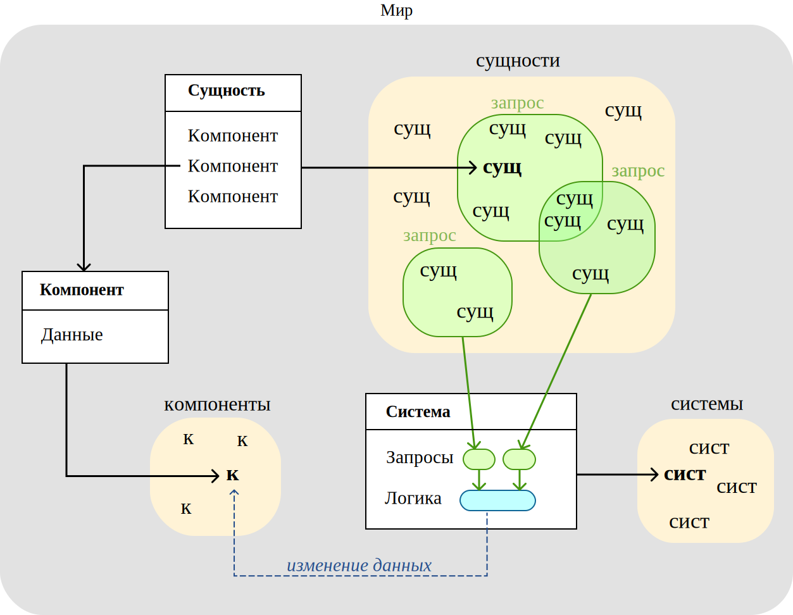
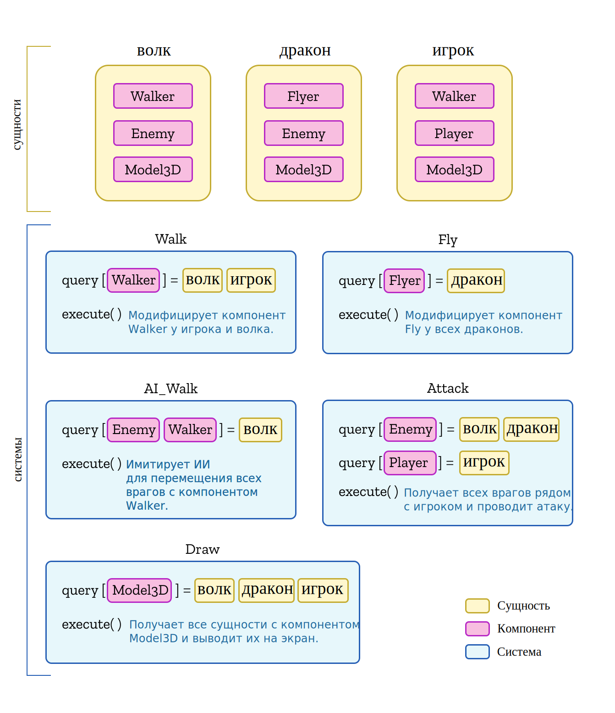

# Основы

ECS (Entity Component System) это архитектурный паттерн, в котором логика описана в виде списка систем, которые оперируют списком сущностей, каждая из которых состоит из динамического списка простых компонентов с данными. Системы выбирают, какие сущности обрабатывать при помощи эффективных запросов, которые работают на основе "слепка" того, какие компоненты есть у сущности.

Как уже было описано в [основах ECS](../getting-started) (с которыми стоит ознакомиться, если это не было сделано ранее), основные понятия ECS включают:
- [сущности](ru/architecture/entities): объект с уникальным идентификатором, имеющий множество компонентов.
- [компоненты](ru/architecture/components): Различные характеристики сущностей, такие как форма, физический свойства, хитбоксы. Компонент это единственное место, где хранятся данные сущностей.
- [системы](ru/architecture/systems): часть кода, которая содержит и выполняет логику приложения, путём чтения и изменения компонентов сущностей.
- [запросы](ru/architecture/queries): используются системами, чтобы на основе компонентов определить, какие сущности они обрабатывают.
- [мир](ru/architecture/world): контейнер для сущностей, компонентов, систем и запросов.

Обычное ECS-приложение можно охарактеризовать так:
1. Определение типов *компонентов* на основе данных, обрабатываемых приложением.
2. Создание *сущностей* и добавление в них *компонентов*.
3. Описание *систем*, которые будут использовать *компоненты* чтобы получить и преобразовать данные *сущностей*, полученных *запросом*.
4. Выполнение всех *систем* в каждом кадре.

## Пример

Допустим, мы хотим создать игру, в которой игрок должен будет сражаться с драконами и волками.
Начнём с компонентов, которые позже будут добавлены к сущностям:
- `Walker` и `Flyer` для сущностей, которые будут ходить и летать (соответственно).
- `Enemy` для сущностей-врагов.
- `Player` для сущности-игрока.
- `Model3D` для всех сущностей, которые будут иметь 3D-модель.

Теперь используем компоненты, чтобы определить основные сущности:
- Волк: Это `Enemy`, который `Walker` и имеет `Model3D`.
- Дракон: Это `Enemy`, который `Flyer` и имеет `Model3D`.
- Игрок: Это `Player`, который `Walker` и имеет `Model3D`.

И наконец определим системы, которые будут содержать логику игры:
- `Walk`: Будет модифицировать сущностей, которые `Walker` (игрок и волк), перемещая их по игре.
- `Fly`: Будет модифицировать сущностей, которые `Flyer` (дракон) перемещая их по небу игры.
- `AI_Walk`: Будет модифицировать `Enemy`, которые `Walker` (волк), имитируя искусственный интеллект, чтобы рассчитать путь для их перемещения.
- `Attack`: Будет содержать логику атаки между `Enemy` и `Player`.
- `Draw`: Будет выводить на экран все сущности, у которых есть `Model3D`.

